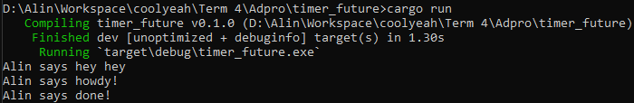
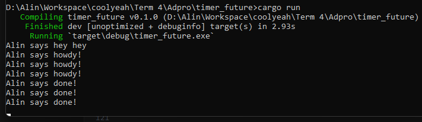
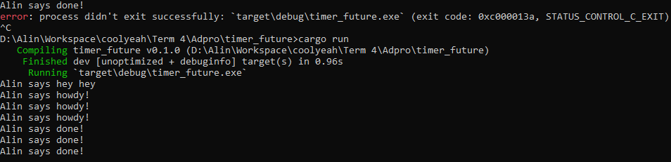

# Tutorial 10 - Adpro

## Aliyah Faza Qinthara

### 1.2. Understanding how it works.

Dari apa yang diperhatikan dari hasil output, terlihat bahwa fungsi async beroperasi di luar fungsi utama yang memanggilnya. Ini berarti bahwa "hey hey" bisa muncul lebih dulu daripada "howdy!" dan "done!", karena "hey hey" dipanggil di luar fungsi async, sedangkan fungsi async menunggu hasil dari future sebelum melanjutkan eksekusi program.

### 1.3. Multiple Spawn and removing drop

Banyak spawner menyebabkan lebih banyak task diantrikan ke dalam pengirim task. Tidak men-drop spawner membuat program terus berjalan, karena diasumsikan akan ada pengiriman data oleh spawner. Drop (spawner) menandakan interaksi selesai. Saat spawner memanggil spawn, task baru disalurkan ke pengirim task. Executor akan mengeksekusi task dari pengirim task hingga task habis dan spawner ditutup, menandakan interaksi selesai.
